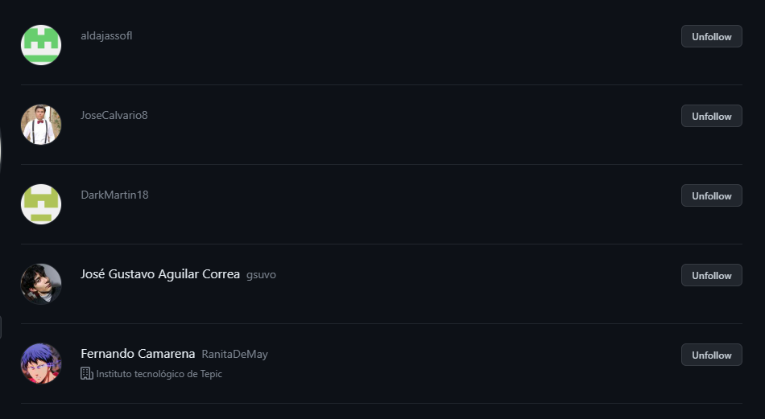

# iw2023ittepic
1. Crear un repositorio en GitHub

2. Clonar el repositorio en local
git clone https://github.com/msalas18/iw2023ittepic.git

3. PUSH Inicial
Subir los cambios al repositorio remoto
git push origin main

4. Ignorar archivos
    4.1Crear en el repositorio local un fichero llamado privado.txt
    
    4.2 Crear en el repositorio local una carpeta llamada privada
    
    4.3 Realizar los cambios oportunos para que tanto el archivo como la carpeta sean ignorados por git
    nano .gitignore
    

5. Añadir archivo
    5.1 Añadir archivo 1.txt al repositorio local
    cd iw2023ittepic
    echo iw2023ittepic > 1.txt

6. Creación de Tag
    6.1 Crear un tag v0.1
    git tag v0.1

7. Subir cambios
    7.1 Subir los cambios al repositorio remoto
    git push v0.1

8. Cuenta de Github
    8.1 Poner una foto en tu perfil de GitHub
    
    8.2 Poner doble factor de autenticación en tu cuenta de GitHub
    
    8.3 Añadir la clave pública que corresponde a tu computadora
    

9. Uso social de GitHub
    9.1 Preguntar los nombres de usuario de GitHub de tus compañeros de clase, búscalos, y síguelos
    9.2 Seguir los repositorios iw2023ittepic del resto de tus compañeros
    9.3 Añadir una estrella a los repositorios iw2023ittepic del resto de tus compañeros
     

10. Creación de tabla
    10.1 Crear una tabla de este estilo en el archivo README.md con la información de al menos 5 de tus compañeros de clase:

|Nombre                        |Github                              |
--------------------------------------------------------------------|             
|Alexis Daniel Jasso Flores    |  https://github.com/aldajassofl    |
|Fernando Camarena Flores      |  https://github.com/RanitaDeMay    |
|José Calvario Ramírez         |  https://github.com/JoseCalvario8  |
|Martín Ernesto Barrón Doroteo |  https://github.com/DarkMartin18   |
|José Gustavo Aguilar Correa   |  https://github.com/gsuvo          |
---------------------------------------------------------------------

